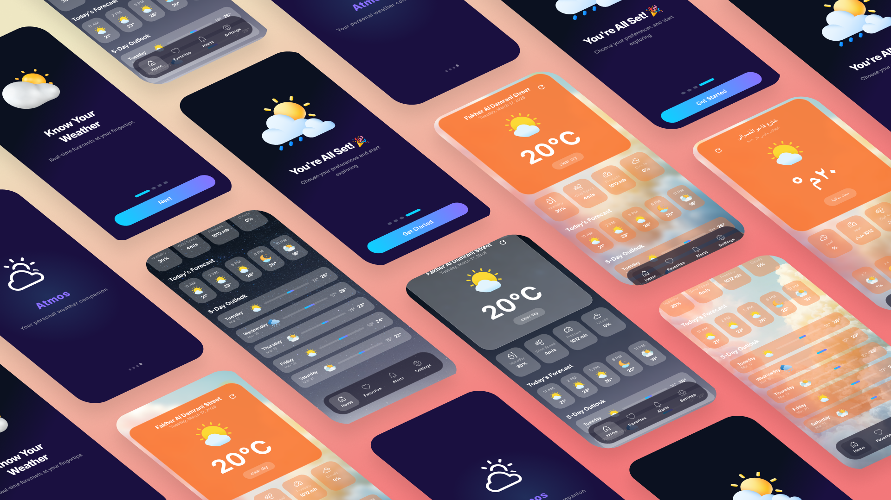
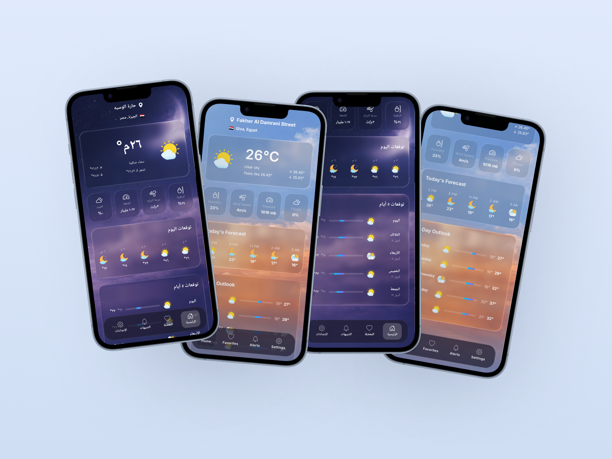
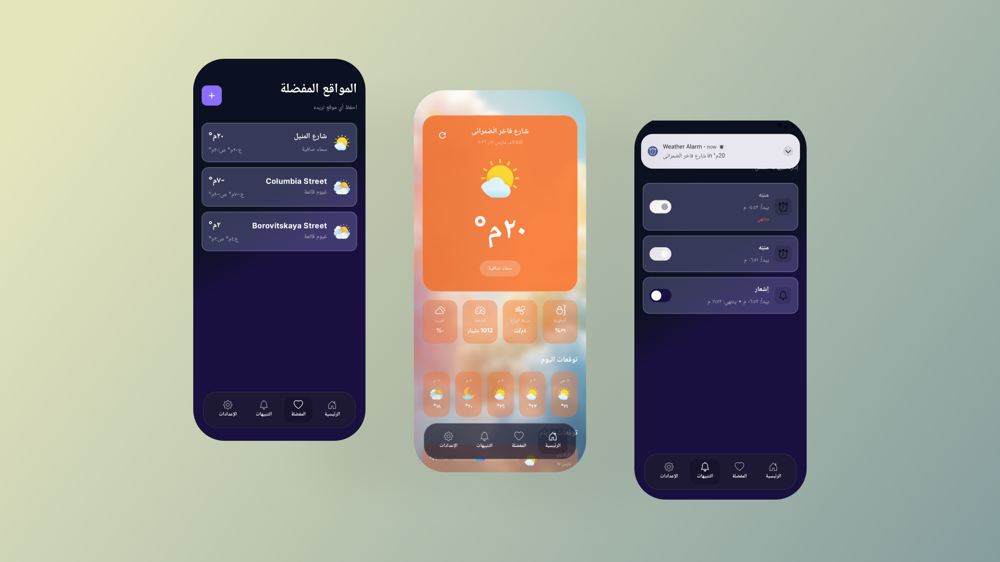

# 🌤️ Atmos — Weather Forecast App


> Your personal weather companion — real-time forecasts, smart alerts, and favorite locations at your fingertips.

---



## 📸 Screenshot
### 🏠 Home Day & Night



### ⭐ Settings & Favorites & Alerts



---

## ✨ Features

### 🏠 Home Screen
- Current temperature, date & time
- Humidity, wind speed, pressure & cloud coverage
- Today's hourly forecast
- 5-day weather outlook
- Dynamic weather illustrations based on condition

### ⚙️ Settings Screen
- **Location:** GPS auto-detect or pick from map
- **Temperature Units:** Celsius, Fahrenheit, Kelvin
- **Wind Speed Units:** m/s, mph
- **Language:** Arabic & English with full localization

### ⭐ Favorites Screen
- Save unlimited favorite locations
- View full forecast for any saved location
- Search and pin locations via Mapbox
- Swipe-to-delete with undo snackbar

### 🔔 Alerts Screen
- Schedule weather alerts by time range
- Two alert types: **Push Notification** or **Alarm**
- Enable / disable individual alerts
- Alerts persist after device reboot

---

## 🏗️ Architecture

Atmos follows **Clean Architecture** with **MVVM** pattern:

```text
┌─────────────────────────────────────────┐
│                   UI                    │
│  Screens → ViewModels → UiState/Events  │
├─────────────────────────────────────────┤
│                 Domain                  │
│     Models · Repository Interfaces      │
├─────────────────────────────────────────┤
│                  Data                   │
│  Remote (Retrofit) · Local (Room/DS)   │
│  Repository Implementations             │
└─────────────────────────────────────────┘
````

### 📁 Project Structure

```text
com.example.atmos/
├── app/                        # Application class
├── data/
│   ├── database/               # Room database & DAOs
│   ├── datasource/             # Local & remote data sources
│   ├── dto/                    # API response models
│   ├── enums/                  # App enums (Language, Units...)
│   ├── mappers/                # DTO ↔ Entity ↔ Domain mappers
│   ├── network/                # Retrofit setup
│   ├── receiver/               # BroadcastReceivers
│   ├── repository/             # Repository implementations
│   └── workers/                # AlertScheduler
├── di/                         # Hilt modules
├── domain/
│   ├── model/                  # Domain models
│   └── repository/             # Repository interfaces
├── ui/
│   ├── alert/                  # Alerts screen
│   ├── basescreen/             # Bottom nav host
│   ├── core/                   # Shared ViewModels
│   ├── favoritedetails/        # Favorite location details
│   ├── favorites/              # Favorites screen
│   ├── home/                   # Home screen
│   ├── map/                    # Mapbox screen
│   ├── navigation/             # Compose navigation
│   ├── onboarding/             # Onboarding flow
│   ├── settings/               # Settings screen
│   ├── splash/                 # Splash screen
│   └── theme/                  # App theme & typography
└── utils/                      # Extensions & helpers
```

---

## 🛠️ Tech Stack

| Category         | Technology                             |
| ---------------- | -------------------------------------- |
| **Language**     | Kotlin                                 |
| **UI**           | Jetpack Compose + Material 3           |
| **Architecture** | MVVM + Clean Architecture              |
| **DI**           | Hilt                                   |
| **Networking**   | Retrofit + OkHttp                      |
| **Local DB**     | Room                                   |
| **Preferences**  | DataStore                              |
| **Maps**         | Mapbox Maps SDK                        |
| **Search**       | Mapbox Search SDK                      |
| **Location**     | Google Play Services Location          |
| **Async**        | Kotlin Coroutines + Flow               |
| **Alerts**       | AlarmManager + BroadcastReceiver       |
| **Images**       | Coil                                   |
| **Animations**   | Lottie                                 |
| **Testing**      | JUnit4 · MockK · Turbine · Robolectric |

---

## 🌐 API

This app uses the **[OpenWeatherMap API](https://openweathermap.org/api)**

| Endpoint                                   | Usage                   |
| ------------------------------------------ | ----------------------- |
| `api.openweathermap.org/data/2.5/weather`  | Current weather         |
| `api.openweathermap.org/data/2.5/forecast` | 5-day / 3-hour forecast |

---

## 🚀 Getting Started

### Prerequisites

* Android Studio Hedgehog or newer
* Min SDK 24
* Mapbox account & access token
* OpenWeatherMap API key

### Setup

1. **Clone the repository**

```bash
git clone https://github.com/yourusername/atmos.git
```

2. **Add API keys** in `local.properties`

```properties
OPENWEATHER_API_KEY=your_openweather_api_key
MAPBOX_PUBLIC_TOKEN=your_mapbox_public_token
MAPBOX_SECRET_TOKEN=your_mapbox_secret_token
```

3. **Add Mapbox Maven** in `settings.gradle.kts`

```kotlin
maven {
    url = uri("https://api.mapbox.com/downloads/v2/releases/maven")
    credentials {
        username = "mapbox"
        password = providers.gradleProperty("MAPBOX_SECRET_TOKEN").get()
    }
    authentication { create<BasicAuthentication>("basic") }
}
```

4. **Build & Run** the project in Android Studio

---

## 🧪 Testing

```text
src/
├── test/                        # Unit Tests
│   ├── repository/              # Repository tests with Fake data sources
│   └── viewmodel/               # ViewModel tests with MockK
└── androidTest/                 # Instrumented Tests
    └── dao/                     # Room DAO tests
```

Run unit tests:

```bash
./gradlew test
```

Run instrumented tests:

```bash
./gradlew connectedAndroidTest
```

---

## 📋 Requirements

* ✅ Current weather display (temp, humidity, wind, pressure, clouds)
* ✅ Hourly forecast for current day
* ✅ 5-day weather outlook
* ✅ GPS & manual location selection
* ✅ Favorite locations with full forecast
* ✅ Weather alerts (notification & alarm)
* ✅ Boot-persistent alarms
* ✅ Arabic & English localization
* ✅ Temperature units (°C, °F, K)
* ✅ Wind speed units (m/s, mph)

---

## 📄 License

```text
MIT License

Copyright (c) 2026 Atmos

Permission is hereby granted, free of charge, to any person obtaining a copy
of this software and associated documentation files (the "Software"), to deal
in the Software without restriction, including without limitation the rights
to use, copy, modify, merge, publish, distribute, sublicense, and/or sell
copies of the Software, and to permit persons to whom the Software is
furnished to do so, subject to the following conditions:

The above copyright notice and this permission notice shall be included in all
copies or substantial portions of the Software.
```

See the full [MIT License](LICENSE) for details.

---

<p align="center">Made with ❤️ using Kotlin & Jetpack Compose</p>
